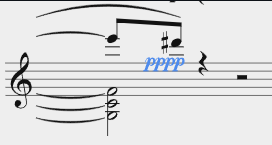

# Report
In this repository, I am presenting both my files and a report where I comment on what worked out and what did not. In the .md version, the images are embedded in LaTeX in order to make them appear in the pdf-version. I didn't figure out yet how to make the photos appear simultaneosly in the .md and the pandoc generated .pdf file while not messing up the formatting. I am sorry for that!

## Schoenberg_6Kleine_Klavierstuke_Op19.pdf

The VI. sentence of this file was my reference file during the encoding process. It was accessed on IMSLP and has the following score ID: #316747. 

## mDivSchoenberg.mei

This file was an attempt of mine to split the score into two separate `<mDiv>` elements in order to tackle a rendering problem with the additional third staff starting from measure 7. It also will be discussed later on.

## SchoenbergEncoding.mei

This file is my encoding result.


(Disclaimer: **I did not use any kind of AI for the encoding**. During the last lecture, I tried a few prompts and the results were not good at all. So I decided to not include it into my workflow at all, solely relying on the Guidelines and the things we've learned during the course.)
Throughout the encoding process with _mei-friend_, I mostly rendered the notation with the _System and page_-Layout.

**Final product (visualized with the above-mentioned Layout):**

```{=latex}
\begin{figure}[H]
\centering
\includegraphics[width=0.7\textwidth]{pictures/MEIpictures/13result.png}
\caption{Result}
\end{figure}
```

# Motivation

When we were told to look up a suitable piece to encode, I wanted to find something that a) included new concepts I haven't used in MEI yet and b) is not longer than 20 measures. After doing a little bit of research, I decided to try the *VI.* from *Schoenbergs Sechs kleine Klavierstücke, Op.19*. At first glance, I already discovered several things that I knew would become difficult to encode, such as the additional third line during the last few measures, multiple layers within the staves (partially even within triplets), etc.
In my opinion it is a perfect piece to practice key concepts of MEI music encoding because of its high density of encoding questions covered in only a handful of measures.


# What worked well
In general, I am positively surprised how much can be done in MEI despite not being very experienced in terms of music encoding. 
Learning the basics such as how to place notes, arrange chords and adding accidentals was relatively intuitive. Due to the fact that the mei-friend automatically assigns @xml:id attributes to every encoded object, jumping to a specific measure or an exact note could also easily be done. Despite that, I quickly faced problems that were not solveable for me at first, such as changing the exact height of the `<pedal>` element in measures 5&6. At some point I was able to fix this issue because I figured out that the @ho and @vo attributes can be used in scenarios where the positions of certain elements in the score have to be changed in order to be matching with the reference-sheet. 

<!--
**Before (@vo / @ho not adjusted):**


-->


```{=latex}
\begin{figure}[H]
\centering
\includegraphics[width=0.7\textwidth]{pictures/MEIpictures/1Before_v.png}
\caption{Measure 4: Before adding @vo}
\end{figure}
``` 
<!-- 
**After (using @vo):**


-->


```{=latex}
\begin{figure}[H]
\centering
\includegraphics[width=0.7\textwidth]{pictures/MEIpictures/2After_vo.png}
\caption{Measure 4: After adding @vo}
\end{figure}
``` 

Another interesting aspect of MEI that I've discovered is the usage of either the @tie attribute or the `<slur>` element. From my point of view, I figured that @tie is very useful in situations like this:

```{=latex}
\begin{figure}[H]
\centering
\includegraphics[width=0.7\textwidth]{pictures/MEIpictures/3tie.png}
\caption{Measure 1: Tie example}
\end{figure}
```

Here, the same pitch is being held across multiple notes.
Whereas in other situations like this:

```{=latex}
\begin{figure}[H]
\centering
\includegraphics[width=0.7\textwidth]{pictures/MEIpictures/4tie.png}
\caption{Measure 5: Slur example}
\end{figure}
```

connecting the highest notes of the chords has to be done with a `<slur>` element. 
Also, in Chapter _4.3.2 (Ties, Slurs and Phrase Marks)_ of the Guidelines, there is explained that slur can also be encoded as an attribute. However, I did not really do that in my encoding because I was already kind of used to creating slurs as elements.

During the course, we already figured that using @tstamp and @tstamp2 instead of @startid and @endid in a `<slur>` element has an impact on the visualization. In most of my cases, I went with the ID-approach because oftentimes a more "tight" connection of the slur was needed. 

Placing accents with an `<artic>` element within the `<note>` element was very convenient and by adding a @place to it, defining the location also worked out fine.

Furthermore, encoding that accidentals stay the same despite not explicitly written (like the f-sharp in measure 1) has to be done with the @accid.ges attribute within a `<note>` element. 

One thing confused me when I looked up Chapter *4.2.5.2.1 (Chords in CMN)* of the MEI Guidelines: In the according example, there is a C-sharp minor excerpt (*Figure 12*) and directly below it, there is an excerpt of the encoding (*Listing 133*). I do not understand, why adding @accid.ges is needed for notes that are already sharp by definition due to the key signature of C-sharp such as C or G...


In addition to that, adding metadata within the `<meiHead>` also worked out fine. However, the metadata-section was not my primary focus because I first wanted to learn how to properly encode the music itself before doing a deep-dive into aspects like adding metadata. 


# Problems

(Disclaimer: The problems I am referring to are also mentioned in comments within the MEI-file itself.)


At the beginning of the piece, the tempo reads _Sehr langsam (♩)_. Thus I tried to render this quarter note symbol ♩ by adding a `<dir>` element and a `<symbol>` element within it:

**How I tried to encode the quarter note symbol at first:**

```{=latex}
\begin{figure}[H]
\centering
\includegraphics[width=1\textwidth]{pictures/MEIpictures/5code.png}
\caption{Quarter note code}
\end{figure}
```
**The result of that in Verovio:**

```{=latex}
\begin{figure}[H]
\centering
\includegraphics[width=0.5\textwidth]{pictures/MEIpictures/6langsam.png}
\caption{Quarter note result}
\end{figure}
```
I couldn't figure out how to adjust the size of the note symbol. By looking up the valid attributes for `<symbol>`, I found the @scale attribute but adding that did not change the rendered version in Verovio. 
In order to at least have the symbol integrated (despite probably not being the best way to do it) I added the unicode-symbol ♩ into my encoding.

Within measure 3, there are a couple of aspects that are not right yet: 

**Firstly**, the curving of the tie on the d-sharp in the first staff should be not that "flat", a little bit more round (compare the reference sheet). Replacing the `<tie>` element with a `<slur>` did not help at all, in fact it even made the positioning worse.

**Secondly**, the direction of the tie on the a-note within the first staff should be below and not above; I tried replacing the @tie with a `<slur>` element and therefore adding the a-note in measure 3 as @startid and the a-note in measure 4 as @endid but by doing so, the slur only appeared at the start of measure 4.

**Thirdly**, looking at the high d-sharp within the 2nd staff; I encoded a `<slur>` with @startid and @endid where the starting note is the mentioned high d-sharp (staff 2, measure 3) and the ending note is the other high d-sharp (staff 2, measure 4). Despite that, the first half of the slur is not getting rendered sometimes.

When I set the rendering mode to _Automatic_, it does get rendered (see the blue slur in the picture):

```{=latex}
\begin{figure}[H]
\centering
\includegraphics[width=0.7\textwidth]{pictures/MEIpictures/7renderer.png}
\caption{Rendering mode: Automatic}
\end{figure}
```
But when setting it to _System and page_ (that's the view I had set for nearly the entire time when encoding the piece):

```{=latex}
\begin{figure}[H]
\centering
\includegraphics[width=0.7\textwidth]{pictures/MEIpictures/8renderer.png}
\caption{Rendering mode: System and page}
\end{figure}
```
The second half of the slur is gone; I tried googling and finding something in the guidelines but I couldn't figure out how to solve this. I am pretty sure that we've already stumbled across that problem during the course itself... 

Implementing the @accid.ges attribute inside of `<note>` elements where it was needed worked out fine most of the time. Looking at the second c-sharp in measure 7, when I try to add an @accid.ges to that specific note, it influences the stem direction and removes one note.

**Without @accid.ges in the 2nd c-sharp:**

```{=latex}
\begin{figure}[H]
\centering
\includegraphics[width=0.7\textwidth]{pictures/MEIpictures/9accid.png}
\caption{C-sharp without @accid.ges}
\end{figure}
```
**With @accid.ges added to the 2nd c-sharp:**
```{=latex}
\begin{figure}[H]
\centering
\includegraphics[width=0.6\textwidth]{pictures/MEIpictures/10accid.png}
\caption{C-sharp with @accid.ges}
\end{figure}
```
It might have something to do with the fact that both these notes are embedded within `<beam>` elements but other than that, I have no clue why that happens or whether that might be a rendering issue.

Within the two latest pictures, you can already spot another issue I faced concerning the rendering of clefs. This we also discussed earlier in the course but even several weeks later, I still couldn't figure out how to solve the issue that the bass clef in the 2nd staff disappears when the third staff is being implemented. After splitting the score into two `<mDiv>`s (which we thought could be the solution) the problem still existed. I've uploaded the file *mDivSchoenberg.mei* (that was at a much earlier state of my encoding) in which I tried to divide the score with two `<mDiv>` elements but I am not sure whether that was the right way to do it because when the second `<mDiv>` should start, it does not even get rendered... I tried switching up the @type attribute with @label but that did not help either. Moreover, probably due to the implementation of the third staff, the encoded @brace in `<grpSym>` (within `<staffGrp>`) is only being rendered partially starting from measure 7.

Looking at the second staff in measure 8, the f-sharp should not be part of the chord. I tried encoding it onto a separate layer (like I did with the g-note it leads to) but it did not work because it is within a triplet and so adding a `<space>` element would not make it appear at the right time. 

**How it looks in my encoding:**
```{=latex}
\begin{figure}[H]
\centering
\includegraphics[width=0.7\textwidth]{pictures/MEIpictures/14fsharp.png}
\caption{Measure 8: f-sharp in my encoding}
\end{figure}
```

**How it should look:**
```{=latex}
\begin{figure}[H]
\centering
\includegraphics[width=0.7\textwidth]{pictures/MEIpictures/15fsharp.png}
\caption{Measure 8: f-sharp in the reference sheet}
\end{figure}
```

Furthermore, there are aspects of the visual appearance that need to be addressed at some point such as the engraving style and the general typography. In Chapter 9.2.2 (Text Rendition) of the Guidelines, it is explained that the font of text is changeable. However, I tried to change the font by adding a `<rend>` element withn the `<dir>` element.

```{=latex}
\begin{figure}[H]
\centering
\includegraphics[width=0.7\textwidth]{pictures/MEIpictures/16code.png}
\caption{Measure 7: Code of text directive "mit sehr zartem Ausdruck"}
\end{figure}
```
