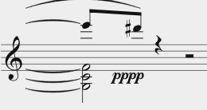

# Report
In this repository, I am presenting both my files and a report where I comment on what worked out and what did not.

(Disclaimer: **I did not use any kind of AI for the encoding**. During the last lecture, I tried a few prompts and the results were not good at all. So I decided to not include it into my workflow at all, solely relying on the Guidelines and the things we've learned during the course.)

### Motivation

When we were told to look up a suitable piece to encode, I wanted to find something that a) included new concepts I haven't used in MEI yet and b) is not longer than 20 measures. After doing a little bit of research, I decided to try the *VI.* from *Schoenbergs Sechs kleine Klavierstücke, Op.19*. At first glance, I already discovered several things that I knew would become difficult to encode, such as the additional third line during the last few measures, multiple layers within the staves (partially even within triplets), etc.
In my opinion it is a perfect piece to practice key concepts of MEI music encoding because of its high density of encoding questions covered in only a handful of measures.

### What worked well
In general, I am positively surprised how much can be done in MEI despite not being very experienced in terms of music encoding. 
Learning the basics such as how to place notes, arrange chords and adding accidentals was relatively intuitive. Due to the fact that the mei-friend automatically assigns @xml:id attributes to every encoded object, jumping to a specific measure or an exact note could also easily be done. Despite that, I quickly faced problems that were not solveable for me at first, such as changing the exact height of the `<pedal>` element in measures 5&6. At some point I was able to fix this issue because I figured out that the @ho and @vo attributes can be used in scenarios where the positions of certain elements in the score have to be changed in order to be matching with the reference-sheet. 

**Before (@vo / @ho not adjusted):**

**After (using @vo):**

Another interesting aspect of MEI that I've discovered is the usage of either the @tie attribute or the `<slur>` element. From my point of view, I figured that @tie is very useful in situations like this:

Here, the same pitch is being held across multiple notes.
Whereas in other situations like this:

connecting the highest notes of the chords has to be done with a `<slur>` element. 
Also, in Chapter _4.3.2 Ties, Slurs and Phrase Marks_ of the Guidelines, there is explained that slur can also be encoded as an attribute. However, I did not really try that in my encoding because I was already kind of used to creating slurs as elements.

During the course, we already figured that using @tstamp and @tstamp2 instead of @startid and @endid in a <slur> element creates a different slur. In most of my cases, I went with the id-approach because oftentimes a more "tight" connection of the slur was needed. 

Placing accents with an `<artic>` element within the `<note>` element was very convenient and by adding a @place to it, defining the location also worked out fine.

Furthermore, encoding that accidentals stay the same despite not explicitly written (like the f sharp in measure 1) has to be done with the @accid.ges attribute within a `<note>` element. One thing that confused me was when I looked up Chapter *4.2.5.2.1 Chords in CMN* of the MEI Guidelines. In the according example, there is a C-sharp minor excerpt (*Figure 12*) and directly below it, there is an excerpt of the encoding (*Listing 133*). I do not understand, why adding @accid.ges is needed for notes that are already sharp by definition due to the key signature of C-sharp such as C or G...

In addition to that, adding metadata within the `<meiHead>` also worked out fine. However, the metadata-section was not my primary focus because I first wanted to learn how to properly encode the music itself before doing a deep-dive into aspects like adding metadata. 

### Problems

(Disclaimer: Every issue I am referring to is also mentioned/explained in comments within the MEI-file itself.)

At the beginning of the piece, the tempo reads _Sehr langsam (𝅘𝅥)_. Thus I tried to render this quarter note symbol 𝅘𝅥 by adding a `<dir>` element and a `<symbol>` element within it:

**How I tried to encode the quarter note symbol at first:**

**The result of that in Verovio:**

I couldn't figure out how to adjust the size of the note symbol. By looking up the valid attributes for `<symbol>`, I found the @scale attribute but adding that did not change the rendered version in Verovio. 
In order to at least have the symbol integrated (despite probably not being the best way to do it) I added the unicode-symbol 𝅘𝅥 into my encoding.

Within measure 3, there are two aspects that should be a little bit different: 

**Firstly**, the curving of the tie on the d-sharp in the first staff should be not that "flat", a little bit more round (compare the reference sheet). Replacing the `<tie>` element with a `<slur>` did not help at all, in fact it even made the positioning worse.

**Secondly**, looking at the high d-sharp within the 2nd staff; I encoded a `<slur>` with @startid and @endid where the starting note is the mentioned high d-sharp (staff 2, measure 3) and the ending note is the other high d-sharp (staff 2, measure 4). Despite that, the first half of the slur is not getting rendered sometimes.

When I set the rendering mode to _Automatic_, it does get rendered (see the blue slur in the picture):

But when setting it to _System and page_ (that's the view I had set for nearly the entire time when encoding the piece):

The second half of the slur is gone; I tried googling and finding something in the guidelines but I couldn't figure out how to solve this. I am pretty sure that we've already stumbled across that problem during the course itself... 

Implementing the @accid.ges attribute inside of `<note>` elements where it was needed worked out fine most of the time. Looking at the second c-sharp in measure 7, when I try to add an @accid.ges to that specific note, it influences the stem direction and removes one note.

**Without @accid.ges in the 2nd c-sharp:**

**With @accid.ges added to the 2nd c-sharp:**

It might have something to do with the fact that both these notes are embedded within `<beam>` elements but other than that, I have no clue why that happens or whether that might be a rendering issue.

Within the two latest pictures, you can already spot another issue I faced concerning the rendering of clefs. This we also discussed earlier in the course but even several weeks later, I still couldn't figure out how to solve the issue that the bass clef in the 2nd staff disappears when the third staff is being implemented. 
- Rendering first 2 staves and then adding the 3rd staff; splitting the score into two separate `<mDiv>`s did not help either. Compare file *mDivSchoenberg.mei*

**- What does not work and why? Compare comments in the mei-document
- What did I try to fix it?**
- M. 8; We have two layers and `<rest>` element within `<tuplet>`; I could'nt figure out how to only show one rest that counts for both layers. Tried: `<space>` instead of rest, this shoves the triad.
- fonts 
- determine exact positions
